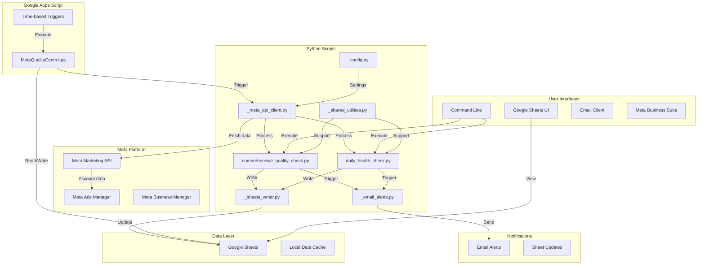

# Architecture Documentation

## Overview

The Meta Ads Quality Control system is a hybrid architecture combining:
- **Python scripts** for automated Meta API interactions and analysis
- **Google Apps Script** for Google Sheets integration and automation
- **Google Sheets** for data storage, reporting, and dashboards
- **External integrations** (Email alerts, Meta Business Manager)

---

## System Architecture



---

## Components

### 1. Python Scripts

#### Core Quality Scripts

**`comprehensive_quality_check.py`**
- **Purpose**: Full account audit and quality assessment
- **Frequency**: Weekly or on-demand
- **Outputs**: Detailed quality report to Google Sheets
- **Key Functions**:
  - Campaign structure analysis
  - Budget utilization review
  - Audience targeting quality
  - Creative performance analysis
  - Conversion tracking validation
  - Account settings audit

**`daily_health_check.py`**
- **Purpose**: Daily monitoring and alerting
- **Frequency**: Daily (automated via cron/scheduler)
- **Outputs**: Health status to Google Sheets + Email alerts
- **Key Functions**:
  - Active campaigns monitoring
  - Budget pacing checks
  - Performance anomaly detection
  - Delivery issues identification
  - Conversion tracking health

#### Support Modules

**`_meta_api_client.py`**
- **Purpose**: Meta Marketing API interface
- **Functions**:
  - API authentication (OAuth)
  - Account data retrieval
  - Campaign/Ad Set/Ad fetching
  - Insights data collection
  - Error handling and retry logic
  - Rate limiting management

**`_sheets_writer.py`**
- **Purpose**: Google Sheets data export
- **Functions**:
  - Sheet creation and formatting
  - Data writing with batching
  - Conditional formatting
  - Chart generation
  - Cell formatting (colors, fonts)

**`_email_alerts.py`**
- **Purpose**: Email notification system
- **Functions**:
  - SMTP configuration
  - HTML email templates
  - Priority-based alerting
  - Attachment handling
  - Error notifications

**`_shared_utilities.py`**
- **Purpose**: Common utility functions
- **Functions**:
  - Date/time handling
  - Number formatting
  - Data validation
  - Logging helpers
  - File I/O operations

**`_config.py`**
- **Purpose**: Configuration management
- **Functions**:
  - Environment variable loading
  - API credentials management
  - Default settings
  - Configuration validation

### 2. Google Apps Script

**`MetaQualityControl.gs`**
- **Purpose**: Google Sheets automation and scheduling
- **Functions**:
  - Time-based triggers
  - Sheet initialization
  - Data refresh automation
  - Menu customization
  - Python script integration (via HTTP endpoints if configured)

### 3. Data Storage

**Google Sheets Structure**:
```
Meta Quality Control Spreadsheet
├── Summary Dashboard
├── Daily Health Checks
├── Campaign Analysis
├── Ad Set Analysis
├── Ad Creative Analysis
├── Audience Analysis
├── Budget Tracking
├── Conversion Tracking
├── Issues Log
└── Historical Trends
```

### 4. External Integrations

**Meta Marketing API**
- Version: Latest stable (v19.0+)
- Authentication: OAuth 2.0
- Permissions: ads_read, ads_management
- Rate limits: 200 calls per hour (standard)

**Google Sheets API**
- Version: v4
- Authentication: Service Account
- Permissions: Read/Write to specific sheets

---

## Data Flow

### Daily Health Check Flow

```
1. Scheduler triggers daily_health_check.py
2. Script loads configuration from _config.py
3. _meta_api_client.py authenticates with Meta API
4. Fetch account data:
   - Active campaigns
   - Budget data
   - Performance metrics (last 24 hours)
   - Conversion events
5. _shared_utilities.py processes and validates data
6. Analyze data for:
   - Budget pacing issues
   - Performance anomalies
   - Delivery problems
   - Conversion tracking health
7. _sheets_writer.py writes results to Google Sheets
8. If issues found:
   - _email_alerts.py sends priority emails
9. Log execution status
```

### Comprehensive Quality Check Flow

```
1. User/System triggers comprehensive_quality_check.py
2. Load configuration
3. Authenticate with Meta API
4. Fetch comprehensive account data:
   - All campaigns (active + paused)
   - Ad sets and targeting
   - Ad creatives
   - Audiences
   - Conversion events
   - Historical performance (30 days)
5. Run quality assessments:
   - Campaign structure best practices
   - Targeting analysis
   - Budget allocation
   - Creative diversity
   - Conversion tracking setup
   - Account settings
6. Generate quality scores and recommendations
7. Write detailed report to Google Sheets
8. Send summary email
9. Update historical tracking
```

---

## Technology Stack

### Python Environment
- **Python Version**: 3.9+
- **Key Libraries**:
  - `facebook-business` (Meta Marketing API SDK)
  - `google-auth` + `gspread` (Google Sheets)
  - `pandas` (Data manipulation)
  - `python-dotenv` (Environment config)
  - `loguru` (Logging)
  - `aiohttp` (Async HTTP requests)

### Google Apps Script
- **Runtime**: V8 Engine
- **Libraries**: Native Google Services

### Authentication
- **Meta**: OAuth 2.0 with long-lived access tokens
- **Google Sheets**: Service Account JSON key

---

## Configuration

### Environment Variables (.env)

```bash
# Meta API Configuration
META_APP_ID=your_app_id
META_APP_SECRET=your_app_secret
META_ACCESS_TOKEN=your_access_token
META_AD_ACCOUNT_ID=act_1234567890

# Google Sheets Configuration
GOOGLE_SHEETS_CREDENTIALS_FILE=path/to/service-account.json
SPREADSHEET_ID=your_spreadsheet_id

# Email Configuration
EMAIL_SMTP_SERVER=smtp.gmail.com
EMAIL_SMTP_PORT=587
EMAIL_FROM=alerts@yourdomain.com
EMAIL_TO=team@yourdomain.com
EMAIL_PASSWORD=your_app_password

# Thresholds
DAILY_BUDGET_THRESHOLD=0.8
ANOMALY_DETECTION_STD_DEV=2.0
MIN_CONVERSION_RATE=0.01
```

### Script Configuration

Each script supports configuration via:
1. Environment variables (.env file)
2. Command-line arguments
3. Default values in `_config.py`

---

## Deployment

### Local Development

```bash
# 1. Clone repository
git clone https://github.com/yourusername/meta-ads-quality-control.git
cd meta-ads-quality-control

# 2. Install dependencies
pip install -r requirements.txt

# 3. Configure environment
cp .env.example .env
# Edit .env with your credentials

# 4. Run tests (when available)
pytest tests/

# 5. Run scripts
python scripts/daily_health_check.py
python scripts/comprehensive_quality_check.py
```

### Production Deployment

**Option 1: Cron/Task Scheduler**
```bash
# Linux/Mac crontab
0 9 * * * /usr/bin/python3 /path/to/daily_health_check.py
0 9 * * 1 /usr/bin/python3 /path/to/comprehensive_quality_check.py

# Windows Task Scheduler
# Schedule daily_health_check.py at 9 AM daily
# Schedule comprehensive_quality_check.py at 9 AM Mondays
```

**Option 2: Cloud Functions (AWS Lambda, Google Cloud Functions)**
```
1. Package scripts + dependencies
2. Upload to cloud function
3. Configure triggers (CloudWatch Events, Cloud Scheduler)
4. Set environment variables
5. Monitor execution logs
```

**Option 3: Docker Container**
```dockerfile
FROM python:3.9-slim
WORKDIR /app
COPY requirements.txt .
RUN pip install -r requirements.txt
COPY scripts/ ./scripts/
CMD ["python", "scripts/daily_health_check.py"]
```

---

## Error Handling

### Meta API Errors

| Error Code | Meaning | Handling |
|------------|---------|----------|
| 190 | Access token expired | Re-authenticate with OAuth |
| 17 | Rate limit exceeded | Exponential backoff retry |
| 100 | Invalid parameter | Log error, skip request |
| 200-299 | Permission errors | Check app permissions |
| 1 | Unknown error | Retry with backoff |

### Google Sheets Errors

| Error | Handling |
|-------|----------|
| 401 Unauthorized | Regenerate service account key |
| 429 Rate Limit | Batch requests, add delays |
| 403 Forbidden | Check sheet sharing permissions |

### Retry Strategy

```python
# Exponential backoff with jitter
max_retries = 3
base_delay = 1  # seconds

for attempt in range(max_retries):
    try:
        # API call
        break
    except RateLimitError:
        if attempt < max_retries - 1:
            delay = (base_delay * 2 ** attempt) + random.uniform(0, 1)
            time.sleep(delay)
        else:
            raise
```

---

## Performance Considerations

### API Optimization

1. **Batch Requests**: Group multiple calls into single batch request
2. **Field Selection**: Request only needed fields (`fields=id,name,status`)
3. **Caching**: Cache account structure for 1 hour
4. **Async Requests**: Use `aiohttp` for concurrent API calls
5. **Rate Limiting**: Respect 200 calls/hour limit

### Google Sheets Optimization

1. **Batch Writes**: Write data in batches of 100+ rows
2. **Clear Old Data**: Delete rows instead of clearing cells
3. **Formula Limits**: Use ARRAYFORMULA for large datasets
4. **Conditional Formatting**: Apply to ranges, not individual cells

---

## Monitoring

### Logging

```python
# loguru configuration
logger.add(
    "logs/quality_control_{time}.log",
    rotation="1 day",
    retention="30 days",
    level="INFO"
)

# Log levels
logger.debug()    # Detailed debugging
logger.info()     # General information
logger.warning()  # Potential issues
logger.error()    # Errors that need attention
logger.critical() # Critical failures
```

### Metrics Tracked

- Script execution time
- API calls made
- Errors encountered
- Data rows processed
- Emails sent
- Sheet updates performed

---

## Security

### Credentials Management

✅ **DO**:
- Store credentials in .env file (not in code)
- Use service accounts for Google Sheets
- Rotate Meta access tokens every 60 days
- Use long-lived tokens (not short-lived)
- Restrict API permissions to minimum required

❌ **DON'T**:
- Commit .env or credentials to git
- Share access tokens publicly
- Use user tokens (use app tokens)
- Hard-code credentials in scripts

### Access Control

1. **Meta Business Manager**:
   - Assign scripts to dedicated System User
   - Grant minimum required permissions
   - Enable 2FA for all users

2. **Google Sheets**:
   - Service account has edit access only
   - User accounts have view/comment access
   - Regular permission audits

---

## Troubleshooting

### Common Issues

**1. "Access token expired"**
```bash
# Solution: Regenerate long-lived token
# Go to Meta Business Manager → Settings → System Users
# Generate new token with 60-day expiration
```

**2. "Google Sheets permission denied"**
```bash
# Solution: Share sheet with service account email
# service-account-name@project-id.iam.gserviceaccount.com
```

**3. "Rate limit exceeded"**
```bash
# Solution: Reduce API call frequency
# Add delays between requests
# Use batch requests
```

**4. "Module not found"**
```bash
# Solution: Install dependencies
pip install -r requirements.txt
```

---

## Future Enhancements

### Planned Features

1. **Advanced Analytics**:
   - Predictive performance modeling
   - Automated A/B test analysis
   - Creative fatigue detection

2. **Auto-Remediation**:
   - Automatic budget redistribution
   - Auto-pause underperforming ads
   - Automatic bid adjustments

3. **Enhanced Reporting**:
   - Looker Studio dashboard integration
   - Slack notifications
   - Mobile app alerts

4. **Machine Learning**:
   - Anomaly detection with ML models
   - Performance forecasting
   - Audience recommendation engine

---

## Support & Documentation

- **GitHub**: [Repository URL]
- **Issue Tracking**: GitHub Issues
- **Documentation**: `/docs` directory
- **Email**: support@yourdomain.com

---

**Last Updated**: 2026-01-28
**Version**: 1.0.0
**Maintained By**: Gordon Geraghty
