# Architecture Documentation

## Overview

The Meta Ads Quality Control system is a hybrid architecture combining:
- **Python scripts** for automated Meta API interactions and analysis
- **Google Apps Script** for Google Sheets integration and automation
- **Google Sheets** for data storage, reporting, and dashboards
- **External integrations** (Email alerts, Meta Business Manager)

---

## System Architecture

---

## Script Execution Flow

---

## Data Flow Diagram

---

## Component Architecture

---

## Health Scoring System

---

## Alert Priority System

```mermaid
graph TD
    Issue[Issue Detected] --> Classify{Classify<br/>Severity}

    Classify -->|Pixel not firing| Critical
    Classify -->|Campaign paused| Critical
    Classify -->|Zero spend| Critical
    Classify -->|Budget exhausted| Critical
    Classify -->|Conversion tracking broken| Critical

    Classify -->|High frequency >3.5| High
    Classify -->|CPA 50% over target| High
    Classify -->|Creative fatigue| High
    Classify -->|Audience exhaustion| High
    Classify -->|Low match quality <6| High

    Classify -->|Frequency 2.5-3.5| Medium
    Classify -->|CPA 25% over target| Medium
    Classify -->|Audience overlap| Medium
    Classify -->|CTR decline 30%| Medium
    Classify -->|Budget pacing off| Medium

    Classify -->|Naming convention| Low
    Classify -->|Optimization opportunity| Low
    Classify -->|Missing UTM tags| Low
    Classify -->|Creative refresh suggested| Low

    Critical[Critical Priority<br/>Immediate Action] --> Email1[🔴 Immediate Email<br/>Subject: URGENT]
    Critical --> Slack1[🔴 Slack Alert<br/>@channel mention]
    Critical --> Dashboard1[🔴 Dashboard: Red Banner]
    Critical --> SMS1[📱 SMS Alert<br/>If configured]

    High[High Priority<br/>Same Day Action] --> Email2[🟠 Priority Email<br/>Subject: HIGH PRIORITY]
    High --> Dashboard2[🟠 Dashboard: Orange Alert]
    High --> Digest2[📊 Include in digest]

    Medium[Medium Priority<br/>This Week Action] --> Email3[🟡 Weekly Summary<br/>Consolidated report]
    Medium --> Dashboard3[🟡 Dashboard: Yellow Warning]
    Medium --> Tracking3[📈 Trend tracking]

    Low[Low Priority<br/>FYI / Nice to Have] --> Dashboard4[🟢 Dashboard Only<br/>No alerts]
    Low --> Report4[📄 Monthly report mention]

    style Critical fill:#ea4335,color:#fff
    style High fill:#ff6600,color:#fff
    style Medium fill:#fbbc04,color:#000
    style Low fill:#0f9d58,color:#fff
```

---

## Deployment Architecture

---

## Security Architecture

---

## Performance Considerations

### API Limits

| Resource | Limit | Optimization Strategy |
|----------|-------|----------------------|
| **Meta API Calls** | 200/hour (standard tier) | Batch requests, cache data 1 hour |
| **Meta API Response Size** | 100 records/call | Use pagination, fetch in chunks |
| **Google Sheets API** | 500 requests/100sec/project | Batch writes (100+ rows), use append |
| **Email SMTP** | Varies by provider | Consolidate alerts, use digest mode |
| **Script Execution Time** | 15 min (Lambda timeout) | Split large accounts, parallel processing |

### Optimization Strategies

---

## Monitoring & Observability

---

## Technology Stack

| Layer | Technology | Version | Purpose |
|-------|-----------|---------|---------|
| **Language** | Python | 3.9+ | Core scripting language |
| **Meta API** | facebook-business SDK | Latest | Meta Marketing API client |
| **Google Sheets** | gspread + google-auth | Latest | Sheets API integration |
| **Data Processing** | pandas | 2.0+ | Data manipulation |
| **HTTP Client** | requests | 2.31+ | API calls |
| **Configuration** | python-dotenv | 1.0+ | Environment management |
| **Logging** | loguru | 0.7+ | Structured logging |
| **Testing** | pytest | 9.0+ | Unit testing framework |
| **Email** | smtplib | Built-in | Email delivery |
| **Scheduling** | cron / Task Scheduler / CloudScheduler | - | Automation |
| **Version Control** | Git/GitHub | - | Source control |
| **Container** | Docker (optional) | 24+ | Containerization |

---

## N8N Workflow Sync Pipeline

This repo automatically syncs quality check logic to the [N8N-meta-ads-quality-control](https://github.com/Empire-Amplify/N8N-meta-ads-quality-control) repo for use as an importable n8n workflow.

### Sync Components

| Component | Location | Purpose |
|-----------|----------|---------|
| `lint.yml` (notify-n8n job) | `.github/workflows/lint.yml` | Triggers dispatch after CI passes |
| `sync-workflows.yml` | N8N repo `.github/workflows/` | Orchestrates the sync process |
| `sync_from_source.py` | N8N repo root | Extracts config, injects JS logic |
| `validate_n8n_workflows.py` | N8N repo root | Validates workflow JSON integrity |
| `meta_quality_analysis.js` | N8N repo `logic/` | JS quality engine (injected into workflow) |

### Config Extraction

The sync script uses regex to extract 22 configuration values from `scripts/_config.py` and injects them as a `SOURCE_CONFIG` object into the n8n Code node. This ensures threshold values (frequency alerts, CPA limits, ROAS minimums, audience sizes) stay in sync.

---

## Future Architecture Enhancements

### Planned Features Roadmap

**Q2 2026 - Advanced Analytics**
- [ ] Creative fatigue prediction using ML
- [ ] Performance forecasting (30-day projections)
- [ ] Looker Studio dashboard templates
- [ ] Advanced audience overlap analysis
- [ ] Competitor spend tracking (via partner data)

**Q3 2026 - Auto-Remediation**
- [ ] Automatic budget reallocation (preview mode)
- [ ] Auto-pause underperforming ads (configurable thresholds)
- [ ] Smart bidding recommendations
- [ ] Automated creative refresh suggestions
- [ ] Budget pacing auto-adjustments

**Q4 2026 - Machine Learning**
- [ ] Neural network-based anomaly detection
- [ ] Lookalike audience recommendations
- [ ] Creative optimization AI (image + text analysis)
- [ ] Conversion prediction models
- [ ] Churn risk prediction

**2027 - Multi-Platform Expansion**
- [ ] Google Ads quality control integration
- [ ] TikTok Ads support
- [ ] LinkedIn Ads support
- [ ] Unified cross-platform dashboard
- [ ] Cross-platform budget optimization
- [ ] Mobile app for alerts and monitoring

---

## Testing Architecture

**Current Test Status:**
- ✅ 28/28 unit tests passing (100%)
- ✅ Core utility functions tested
- ⚠️ Integration tests needed
- ⚠️ E2E tests needed

---

## Documentation

For implementation details and guides:
- [README.md](../README.md) - Getting started and overview
- [SETUP_GUIDE.md](SETUP_GUIDE.md) - Detailed setup instructions (coming soon)
- [CONTRIBUTING.md](../CONTRIBUTING.md) - Contribution guidelines
- [SECURITY.md](../SECURITY.md) - Security policy and best practices
- [CHANGELOG.md](../CHANGELOG.md) - Version history

---

**Last Updated:** February 6, 2026
**Version:** 1.0.0
**Maintained By:** Gordon Geraghty | Empire Amplify
